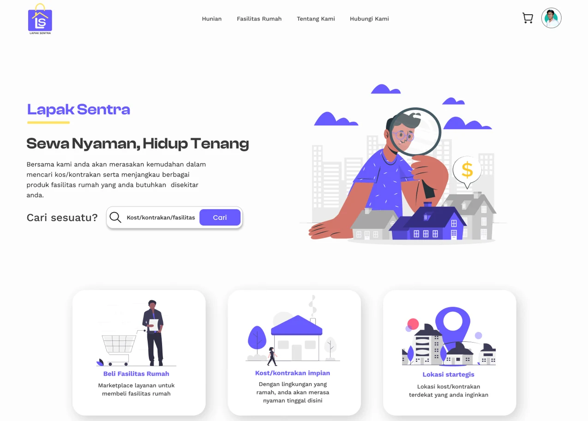
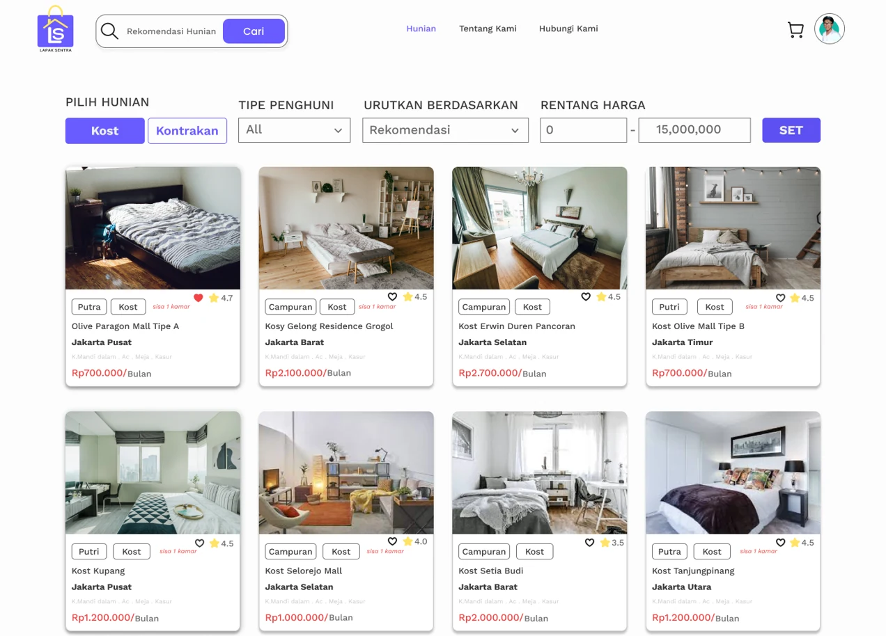

# Lapak Sentra Frontend

React frontend for the Lapak Sentra marketplace prototype.

> **Status:** The frontend interface was completed for the project's original presentation scope. Some screens use local mock data or experimental API calls because backend integration was not completed end-to-end.

## Preview

### Landing Page

### Housing Catalog

> The listings and account information shown in these previews use demonstration data.

## Features

- Landing page and service overview
- Housing and rental catalog
- Property details, facilities, and nearby-location interfaces
- Login and registration interfaces for tenants, property owners, and local businesses
- Tenant profile, favorites, and order interfaces
- Property-owner profile and dashboard
- Local-business profile and dashboard
- Home-goods catalog and product-detail interfaces
- Cart, checkout, and payment interface prototypes
- About and contact pages

## Tech Stack

- React 18
- Vite 5
- Redux Toolkit and React Redux
- React Router
- Tailwind CSS
- Chakra UI
- Axios
- Framer Motion
- Styled Components

## Application Routes

The application uses role-specific routes for tenants, property owners,
and local businesses, alongside public discovery, catalog, cart, order,
and payment interfaces.

See [`src/App.jsx`](./src/App.jsx) for the complete route map.

## Data and API Status

The frontend currently combines:

- Local mock data for several catalog and commerce interfaces
- Experimental API calls to a backend expected at `http://localhost:8000`
- Static presentation data for parts of the cart, order, profile, and payment flows

The frontend is therefore best understood as a complete interface prototype for the original presentation scope, not as a production application connected to a complete backend.

## Frontend Contributors

The frontend implementation was developed collaboratively by:

- [Aldi Musneldi](https://github.com/AldiMusneldi)
- [Muhammad Rafiq](https://github.com/rafiq451)

Return to the [project overview](../README.md).
